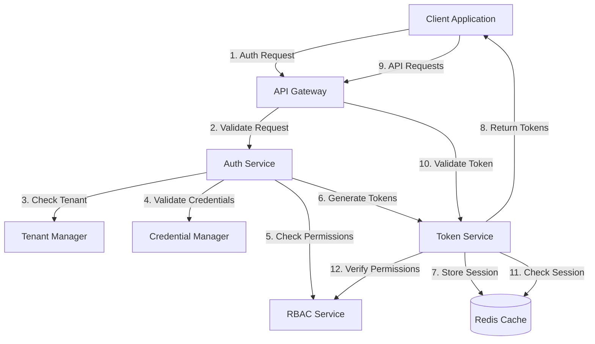
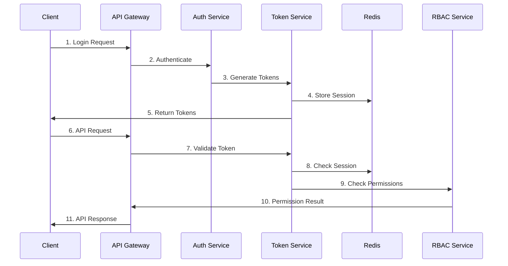

# Secure Authentication Service Architecture

## Overview

The Secure Authentication Service provides a robust authentication and authorization system for Azure resources, with support for multi-tenancy and comprehensive security features.

## System Architecture



## Component Interaction



## Multi-Tenancy Architecture

### Tenant Isolation

1. **Data Segregation**

   - Separate storage for each tenant
   - Tenant-specific encryption keys
   - Isolated session management

2. **Token Scoping**

   ```json
   {
     "sub": "user123",
     "tid": "tenant456",
     "roles": ["admin"],
     "scope": "tenant456/*",
     "permissions": ["read", "write"]
   }
   ```

3. **Storage Structure**
   ```
   /tenants/
     /{tenant_id}/
       /users/
       /roles/
       /permissions/
       /sessions/
   ```

## Security Architecture

### Authentication Flow

1. **Password Handling**

   - Argon2id for password hashing
   - Salt generation per user
   - Work factor configuration

   ```python
   # Password hashing configuration
   HASH_ALGORITHM = "argon2id"
   SALT_LENGTH = 32
   HASH_LENGTH = 64
   TIME_COST = 3
   MEMORY_COST = 65536
   PARALLELISM = 4
   ```

2. **Token Management**
   - JWT for access tokens
   - Secure HTTP-only cookies for refresh tokens
   - Token rotation strategy
   ```python
   # Token configuration
   ACCESS_TOKEN_EXPIRY = 3600  # 1 hour
   REFRESH_TOKEN_EXPIRY = 604800  # 7 days
   TOKEN_ROTATION_THRESHOLD = 300  # 5 minutes
   ```

### RBAC Implementation

1. **Permission Model**

   ```python
   class Permission:
       def __init__(self, resource: str, action: str, scope: str):
           self.resource = resource
           self.action = action
           self.scope = scope

   class Role:
       def __init__(self, name: str, permissions: List[Permission]):
           self.name = name
           self.permissions = permissions
   ```

2. **Permission Enforcement**

   - Resource-level permissions
   - Action-based access control
   - Scope-based restrictions

3. **Role Hierarchy**
   ```
   Admin
   ├── Security Admin
   │   ├── Security Reader
   │   └── Security Contributor
   ├── User Admin
   │   ├── User Reader
   │   └── User Contributor
   └── System Admin
   ```

## Data Flow

### Authentication Flow

1. **Login Process**

   - Client sends credentials
   - Service validates credentials
   - Generates access and refresh tokens
   - Stores session information
   - Returns tokens to client

2. **Token Refresh**

   - Client sends refresh token
   - Service validates refresh token
   - Generates new access token
   - Updates session information
   - Returns new access token

3. **Logout Process**
   - Client sends logout request
   - Service invalidates tokens
   - Clears session information
   - Returns success response

### Authorization Flow

1. **Permission Check**

   - Extract token from request
   - Validate token signature
   - Check token expiration
   - Verify permissions
   - Allow/deny request

2. **Role Assignment**
   - Assign roles to users
   - Map permissions to roles
   - Enforce role hierarchy
   - Handle role inheritance

## Security Measures

### Token Security

1. **Access Token**

   - Short-lived (1 hour)
   - Contains minimal claims
   - Signed with RSA-256
   - Includes permission scope

2. **Refresh Token**
   - Long-lived (7 days)
   - Stored in HTTP-only cookie
   - Includes rotation mechanism
   - Tied to user session

### Session Management

1. **Session Storage**

   - Redis-based session store
   - Encrypted session data
   - Automatic cleanup
   - Session invalidation

2. **Security Headers**
   ```
   Strict-Transport-Security: max-age=31536000; includeSubDomains
   X-Content-Type-Options: nosniff
   X-Frame-Options: DENY
   X-XSS-Protection: 1; mode=block
   ```

## Monitoring and Logging

### Security Logging

1. **Authentication Logs**

   - Login attempts
   - Token generation
   - Session creation
   - Permission changes

2. **Audit Logs**
   - Role assignments
   - Permission changes
   - Configuration updates
   - Security events

### Metrics

1. **Authentication Metrics**

   - Login success rate
   - Token refresh rate
   - Session duration
   - Error rates

2. **Authorization Metrics**
   - Permission check latency
   - Role assignment changes
   - Access patterns
   - Denied requests
